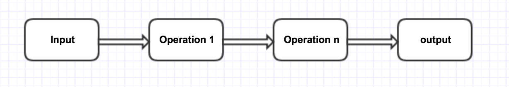

# swiss-army-knife

swiss-army-knife is a library that is the general purpose is received any stream data, operate the data (filter, prefix keys or decorate) and outputted.



swiss-army-knife is also available as a cli tool, for those who wants to use it in the command line.

## Table of Contents

- [Getting started](#getting-started)
    - [Installation](#installation)
        - [Install library](#install-library)
        - [Install swiss-army-knife! cli tool](#install-binaries)
    - [Usage](#usage)
        - [Library](#library)
            - [Operations](#operations)
            - [Input](#input)
            - [Output](#output)
        - [swiss-army-knife! cli tool](#swiss-army-knife!-cli-tool)
- [Contributing](#contributing)

## Getting started

In this getting started guide we will go through how to [install](#installation) and [use](#usage) `swiss-army-knife` as a library and as a cli tool. 

### Installation

#### Install library

```bash
go get -u github.com/dohernandez/swiss-army-knife
```

[[table of contents]](#table-of-contents)

<a name="install-binaries"></a>
#### Install swiss-army-knife! binaries

You can download the binary for your platform of choice from the [releases page](https://github.com/dohernandez/swiss-army-knife/releases/latest).

Once downloaded, the binary can be run from anywhere. Ideally, though, you should move it into your $PATH for easy use. /usr/local/bin is a popular location for this.

[[table of contents]](#table-of-contents)

### Usage

#### Library

`ChannelConveyorProcessor` provides an API to apply operations to a given input data and put the result into a given output. `ChannelConveyorProcessor` takes each 
input item and run each operation one after the other over the item. Finally the result is append to the output. 

`ChannelConveyorProcessor` use a `ChannelConveyor`, which is a part of an implementation of the Pipeline Patterns in Go, to connect the `input-output-input` of the operations using channels.

The following example shows how to create `ChannelConveyorProcessor` to operate stream data coming from `STDIN` and outputted to `STDOUT`.

```go
package main

import (
    "bufio"
    "context"
    "fmt"
    "os"

    swiss_army_knife "github.com/dohernandez/swiss-army-knife"
    sakio "github.com/dohernandez/swiss-army-knife/io"
)

func main() {
	ctx := context.TODO()
	
	// create input Stdin
    scanner := bufio.NewScanner(os.Stdin)
    input := sakio.NewStdinInput(scanner)

    // create output Stdout
    output := sakio.StdoutOutput{}

    p := swiss_army_knife.ChannelConveyorProcessor{}

    if err := p.Process(ctx, input, &output); err != nil {
        panic(err)
    }
}
```

**Note:** The example above, does not do use operation, it only take the input data from `STDIN` and outputted to `SDTOUT`.

#### Operation

Operations are the core of `swiss-army-knife`. It is what make possible to filter, prefix keys or decorate the data.

To add an operation(s) to the process, it is necessary to implement a function with the following contract:

```go
// Operation apply logic (decorate/filter/modify) to the input data.
// Returns any error that occurred, otherwise value processed.
type Operation func(ctx context.Context, value interface{}) (interface{}, error)
```

Using the previous example, let's create an operation to filter object with id 1475 and append the operation to the process.

```go
...
    if err := p.Process(context.TODO(), input, &output, filteringOperation); err != nil {
        panic(err)
    }
...
    
func filteringOperation(ctx context.Context, value interface{}) (interface{}, error) {
    var m interface{}
    
    if err := json.Unmarshal([]byte(i), &m); err != nil {
        return nil, err
    }
    
    // comparison is done using string (used fmt.Sprint) to avoid untyped constant
    // which is the type to which the value is implicitly converted
    if fmt.Sprint(m["id"]) != "1475" {
        return nil, ErrDoNotEmit
    }

    return value, nil
}
```

The following default operations are available in the library.

- `swiss_army_knife.NewFilteringOperation` creates a filtering Operation based on pairs.
- `swiss_army_knife.NewAppendInformationOperation` creates an append information Operation based on pairs.
- `swiss_army_knife.NewRemoveInformationOperation` creates a remove information Operation based on key.
- `swiss_army_knife.NewPrefixKeyOperation` creates a prefix key Operation based on key/prefix pair.

[[table of contents]](#table-of-contents)

#### Input

Input represents the data source. It can be any source, it just have to implement the following contract

```go
// Input defines a contract for input data source.
type Input interface {
	// Next returns the next record of the input source.
	// Starting from the first record when it is call the first time.
	// Returns any error that occurred, including io.EOF when no more record is available.
	Next(ctx context.Context) (interface{}, error)
}
```

[[table of contents]](#table-of-contents)

#### Output

Output represents the output destination. It can be any destination, it just have to implement the following contract.

```go
// Output defines a contract for output data target.
type Output interface {
	// Append adds output data.
	Append(ctx context.Context, output interface{})

	// Write writes the output data into the target.
	// Returns any error that occurred.
	Write(ctx context.Context) error
}
```

The following default output are available in the library.

- `io.StdoutOutput` write the output data to the os.Stdout.

[[table of contents]](#table-of-contents)

#### swiss-army-knife! cli tool

swiss-army-knife! cli tool, is a perfect tool for those who wants to operate any stream data, inputted thro STDIN and outputted to STDOUT

```bash
swiss-army-knife -h

NAME:
   swiss-army-knife - To give some background, the stream of JSON objects can be locations updates from drivers, comments about rides etc. 

USAGE:
   swiss-army-knife [arguments]

COMMANDS:
     help, h  Shows a list of commands or help for one command

GLOBAL OPTIONS:
   --filter value, -f value  Filter out base on key/value pair. Valid format key:value;keyn:valuen. Example id:347.
   --append value, -a value  Append key/value pair. Valid format key:value;keyn:valuen. Example id:347.
   --remove value, -r value  Remove a key. Valid format key:value;keyn:valuen. Example id:347.
   --prefix value, -p value  Prefixing a key. Valid format key:value;keyn:valuen. Example id:347.
   --help, -h                show help
   --version, -v             print the version
```

Example:

Using one operation

```bash
cat locations.json_dump | swiss-army-knife --filter id:482
```

Using multiple operation

```bash
cat locations.json_dump | swiss-army-knife --filter id:482 --prefix "lat:c_;lng:c_"
```

[[table of contents]](#table-of-contents)

## Contributing

We encourage and support an active, healthy community of contributors — including you! Details are in the [contribution guide](CONTRIBUTING.md) and the [code of conduct](CODE_OF_CONDUCT.md).


[[table of contents]](#table-of-contents)
